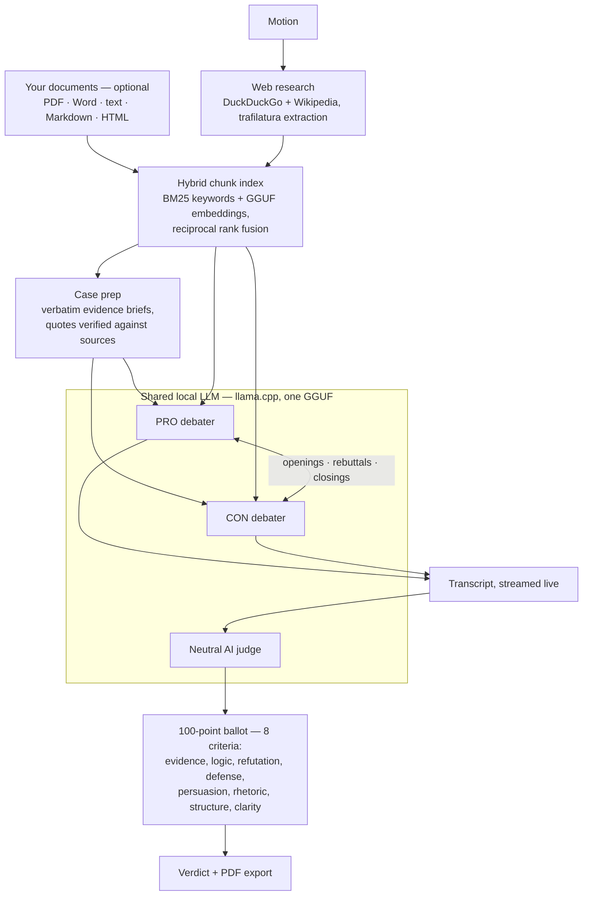

<div align="center">
  <picture>
    <source media="(prefers-color-scheme: dark)" srcset="branding/wordmark-dark.svg">
    
  </picture>
  <p><b>Two AIs debate. One AI judge decides the winner.</b></p>
</div>

Two AIs debate any topic you choose. A neutral AI judge scores the debate
on a 100-point ballot and declares a winner. Everything — both debaters and
the judge — runs on a **single local LLM** (a GGUF model from HuggingFace,
via `llama.cpp`). The debaters are fed through a hybrid keyword + semantic
RAG pipeline built from live web research and any documents you upload
(PDF, Word, text, Markdown, HTML). The whole thing runs with one command:

```bash
docker compose up
```

then open **http://localhost:8000**.

## How it works



1. **Setup** — enter a motion, pick a model, optionally give each debater a
   personality ("proper and Oxford-like", "sassy and sarcastic", …), choose
   the number of rebuttal rounds, and optionally upload your own research
   documents. Motions work best phrased as claims ("X is true"), the way
   real debate motions are; questions are also handled (PRO argues yes,
   CON argues no).
2. **Model** — on *Begin Debate* the app checks available RAM (respecting
   container memory limits) and downloads the highest-quality quantization of
   the chosen model that fits in memory. Already-downloaded models are flagged
   in the UI and reused.
3. **Research** — the app searches the web and Wikipedia, extracts article
   text, and splits it into overlapping chunks indexed two ways: BM25
   keywords and dense vectors from a tiny (~35 MB) GGUF embedding model
   (BGE-small, also run by llama.cpp — auto-downloaded, gracefully skipped
   offline). Before every speech the debater writes its own search queries —
   targeting its side of the motion and the opponent's latest points — and
   the top passages across all queries (both rankings fused with reciprocal
   rank fusion) are stitched with their surrounding text from the original
   document, so quotes arrive with their context. You can also upload your own research materials (PDF, Word,
   text/Markdown or HTML) in the setup screen — they are indexed alongside
   the web research and cited by filename, or used exclusively if you tick
   *Use only my materials*.
4. **Case prep** — first, each side's burden of proof is restated once as
   a plain positive sentence (this keeps small models from flipping sides
   on negated motions like "X never understood Y") and used consistently
   by every later step: prompting, retrieval, side-checking and judging.
   Then each side receives an evidence brief: the source material is swept
   passage by passage, the model copies out quotations that could help
   either side, every quote is verified verbatim against the source
   (hallucinated quotes are dropped), each quote is classified —
   reasoning first — by which side's claim it actually supports, and each
   debater selects its strongest items. This catches decisive material — a
   document's conclusion, a scene at the end of a script — that per-turn
   retrieval can miss. Skippable with `CASE_PREP=0`.
5. **Debate** — classic format, streamed live to the browser token by token:
   openings (PRO, CON) → alternating rebuttal rounds → closings (CON, then PRO
   gets the final word). The debaters must anchor every argument in specific
   evidence, quoting their brief and the per-turn research excerpts.
6. **Judging** — a neutral judge scores each of 8 fine-grained criteria in
   its own focused pass, writing separate reasoning for each side before
   committing to a score (JSON output is grammar-constrained by llama.cpp),
   then writes a closing summary of what each side did well and less well.
7. **Verdict** — winner by total points on the judge's ballot.
   Export the full transcript, ballots and verdict as a PDF.

## Models

| Model | Size | Notes |
|---|---|---|
| **Dolphin 3.0 (Llama 3.1 8B)** — default | 8B | Community fine-tune with no built-in guardrails; debates any topic without refusals |
| Mistral 7B Instruct v0.3 | 7B | Light alignment |
| Qwen 2.5 3B Instruct | 3B | For low-RAM machines |
| Qwen 2.5 1.5B Instruct | 1.5B | Tiny fallback |

Quantization is chosen automatically (preference order Q5_K_M → … → Q2_K)
based on the file sizes reported by the HuggingFace API and the RAM available
to the process. Weights are cached in `./models/` (mounted as a Docker
volume), so they download once.

> ⚠️ The default model is an "uncensored" community fine-tune: it will argue
> either side of contentious motions without refusing. That is the point of a
> debate app — but the output is unmoderated, so use judgement when sharing it.

## Running

```bash
docker compose up --build      # first run builds the image (~a few minutes)
```

- UI: http://localhost:8000
- Runs on CPU by default; no GPU required. An 8B model at Q5/Q4 wants ~8 GB
  free RAM; the 3B/1.5B models run in much less. Expect a few minutes per
  debate on CPU — or use the GPU image below.
- Debates run fully locally — no LLM API keys needed. Network access is used
  only for the one-off model download and per-debate research (if research
  fails or you're offline, the debate proceeds on the model's own knowledge).

### GPU acceleration (NVIDIA)

With an NVIDIA GPU and the [NVIDIA Container
Toolkit](https://docs.nvidia.com/datacenter/cloud-native/container-toolkit/latest/install-guide.html)
installed on the host:

```bash
docker compose -f docker-compose.yml -f docker-compose.gpu.yml up --build
```

The first build is slow (~15+ minutes: it compiles llama.cpp's CUDA kernels
from source), but generation is then typically 10-50x faster than CPU. An 8B
model at Q4 fits in ~6 GB of VRAM. If the model doesn't fit in your VRAM, set
`N_GPU_LAYERS` in `docker-compose.gpu.yml` to a positive number to offload
only part of it and split the rest onto the CPU.

### Development without Docker

```bash
python -m venv .venv && source .venv/bin/activate
pip install -r requirements.txt \
    --extra-index-url https://abetlen.github.io/llama-cpp-python/whl/cpu
uvicorn backend.main:app --reload
```

### Configuration (environment variables)

| Variable | Default | Meaning |
|---|---|---|
| `MODELS_DIR` | `./models` | Where GGUF weights are stored |
| `FAKE_LLM` | off | `1` = canned responses, no model download — full-pipeline demo/dev mode |
| `N_CTX` | `16384` | Context window — raise it if you have the memory (RAM/VRAM budgeting adapts automatically) |
| `N_THREADS` | auto | CPU threads for inference |
| `N_GPU_LAYERS` | `0` | Model layers offloaded to GPU (`-1` = all; needs the CUDA build, see `Dockerfile.gpu`) |
| `MAX_WEB_SOURCES` | `8` | Web pages fetched during research |
| `MAX_WIKI_SOURCES` | `2` | Wikipedia articles fetched |
| `RAG_TOP_K` | `10` | Max distinct passages retrieved per debater turn |
| `RAG_MAX_CHARS` | `10000` | Total research characters given to each turn |
| `RAG_QUERIES` | `3` | Search queries the debater writes for itself per turn |
| `RAG_NEIGHBORS` | `1` | Adjacent chunks stitched around each retrieved passage |
| `MAX_MATERIAL_CHARS` | `600000` | Max characters kept per uploaded document |
| `CASE_PREP` | on | `0` = skip pre-debate evidence mining (faster, weaker arguments) |
| `PREP_WINDOW_CHARS` | `6000` | Size of each source passage scanned during case prep |
| `PREP_MAX_WINDOWS` | `24` | Max passages scanned (larger libraries are pruned to the most motion-relevant passages, plus each document's ending) |
| `PREP_QUOTES_PER_SIDE` | `8` | Verbatim quotes in each side's evidence brief |
| `EMBEDDINGS` | on | `0` = disable semantic search (keyword-only BM25 retrieval) |
| `EMBED_MODEL_REPO` | `CompendiumLabs/bge-small-en-v1.5-gguf` | HF repo of the GGUF embedding model |
| `EMBED_MODEL_FILE` | `bge-small-en-v1.5-q8_0.gguf` | Embedding model file within the repo |

## Project layout

```
backend/
  main.py            FastAPI app, WebSocket live stream, REST API
  debate.py          pipeline orchestration + debater prompting
  judging.py         judge persona, 100-point ballot, tally
  research.py        DuckDuckGo/Wikipedia scraping
  materials.py       user-uploaded research documents (PDF/DOCX/text/HTML)
  rag.py             chunking + hybrid BM25/semantic retrieval (RRF)
  prep.py            pre-debate case prep: verbatim evidence briefs per side
  embeddings.py      GGUF embedding model wrapper (llama.cpp)
  models_registry.py model catalog, RAM-aware quant selection, downloads
  llm.py             llama.cpp wrapper (+ fake mode)
  pdf_export.py      PDF transcript
frontend/            static single-page UI (no build step)
```

## License

MIT — see [LICENSE](LICENSE).
